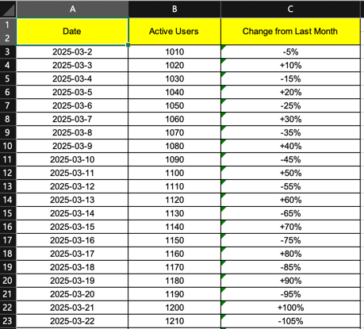

# 🦊 excel-common


excel-common is a library designed to enhance efficiency when handling Excel-related tasks in Spring Boot applications.

Built on Apache POI, it provides functionalities for creating, reading, and writing Excel files.


## Install

### Gradle
```
implementation group: 'io.github.coorr', name: 'excel-common', version: '0.0.2'
```

### Maven
```
<dependency>
    <groupId>io.github.coorr</groupId>
    <artifactId>excel-common</artifactId>
    <version>0.0.2</version>
</dependency>
```


## Quickstart

### 1. Setting Column
To define column, use the `@ExcelColumn` annotation:
```java
public @interface ExcelColumn {
  String headerName() default "";  
  String secondHeaderName() default "";  
  String columnName() default "";  
  boolean required() default false;  
  int row() default 0;  
  int column() default 0;  
  int width() default 5000; 
}
```
- `headerName` : Sets the primary header name.
- `secondHeaderName` : Allows setting a secondary header if needed.
- `columnName` : Defines an internal identifier for the column.
- `required` : If a field is mandatory, set this to true.
- `row`, `column` : Specifies the exact row and column location.
- `width` : Defines the column width.


### 2. Usage Example
```java
public class ExcelDto {
  @ExcelColumn(headerName = "Date", column = 0, width = 6000)
  private String date;

  @ExcelColumn(headerName = "Active Users", secondHeaderName = "Total Users", column = 1)
  private long activeUserCount;

  @ExcelColumn(headerName = "Change from Last Month", column = 2)
  private String differenceFromLastDay;
}
```
- This class is a Data Transfer Object (DTO) that maps Excel data.
- The @ExcelColumn annotation is used to map each field to an Excel column.


```java
private final ExcelDownloadHandler excelDownloadHandler;

public void downloadExcel(HttpServletResponse response) {
  try (BaseWorkBook<ExcelDto> baseWorkBook = excelDownloadHandler.createWorkBook(ExcelDto.class, "sheetName")) {
    baseWorkBook.drawBody(new ExcelDto(...)); // Add body data
    baseWorkBook.output(response, "fileName.xlsx"); // Download file
  } catch (Exception e) {
    throw new RuntimeException(e);
  }
}
```
The following example demonstrates how to generate and download an Excel file using ExcelDownloadHandler.

- createWorkBook(Class<T>, String) : Creates an Excel workbook based on the given DTO class.

- drawBody(List<T>) : Adds body data to the Excel file.

- output(HttpServletResponse, String) : Outputs the Excel file in the response for download.


### 3. Excel File Screenshot
